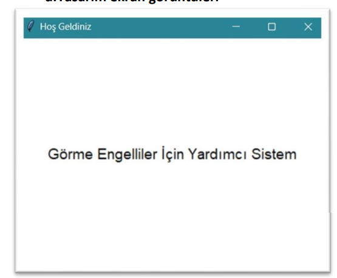
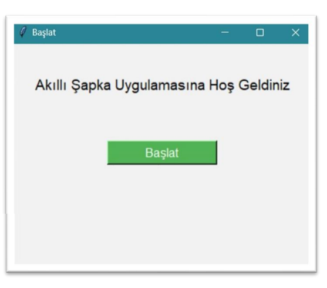
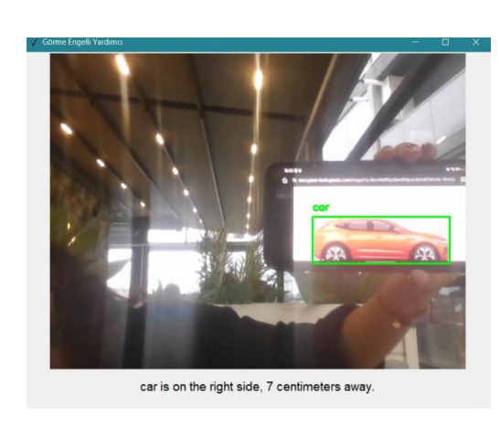

# Görme Engelliler İçin Akıllı Yardımcı Sistem


Görme engelli bireylerin günlük yaşamlarında bağımsız hareket edebilmeleri için tasarlanmış, yapay zeka destekli bir yardımcı sistemdir. Ultrasonik sensör ve bilgisayarlı görü teknolojileri kullanarak çevredeki nesneleri algılar ve kullanıcıyı sesli olarak bilgilendirir.

---

## 📸 Demo

<div align="center">
  
  <p><i>Uygulama arayüzü ve nesne algılama görünümü</i></p>
</div>

### Sistem Görselleri

| Donanım | Arayüz | Çalışma Anı |
|---------|--------|-------------|
|  |  | 

---

## 🎯 Özellikler

- **Gerçek Zamanlı Nesne Algılama**: YOLOv8 derin öğrenme modeli ile çevredeki nesneleri tanır
- **Mesafe Ölçümü**: Ultrasonik sensör ile nesnelere olan uzaklığı ölçer
- **Sesli Geri Bildirim**: Algılanan nesneleri İngilizce olarak sesli bildirim yapar
- **Konum Belirleme**: Nesnenin konumunu (sol, orta, sağ) algılar
- **Sesli Uyarı Sistemi**: Buzzer ile mesafeye göre farklı frekanslarda uyarı verir
- **Kullanıcı Dostu Arayüz**: Tkinter tabanlı görsel arayüz
- **Akıllı Tekrar Önleme**: Aynı nesneyi 15 saniye boyunca tekrar bildirmez

---

## 🛠️ Donanım Gereksinimleri

### Arduino Bileşenleri
- Arduino (Uno/Nano/Mega)
- HC-SR04 Ultrasonik Mesafe Sensörü
- Buzzer (Piezo Speaker)
- Bağlantı kabloları

### Bilgisayar
- Webcam (dahili veya harici)
- USB bağlantısı (Arduino için)

### Pin Bağlantıları

| Arduino Pin | Bileşen |
|------------|---------|
| Pin 10 | Ultrasonik Trig |
| Pin 11 | Ultrasonik Echo |
| Pin 12 | Buzzer |


---

## 📋 Yazılım Gereksinimleri

### Python Kütüphaneleri

```bash
pip install opencv-python
pip install ultralytics
pip install pyttsx3
pip install pyserial
pip install pillow
```

### Arduino Kütüphanesi
- **TimerOne** kütüphanesi (Arduino IDE Library Manager'dan yükleyin)

---

## 🚀 Kurulum

### 1. Projeyi İndirin

```bash
git clone https://github.com/didembi/object-detection-system-for-visually-impaired.git
cd object-detection-system-for-visually-impaired
```

### 2. Python Kütüphanelerini Yükleyin

```bash
pip install -r requirements.txt
```

### 3. Arduino Kodunu Yükleyin

1. Arduino IDE'yi açın
2. `src/arduino_code.ino` dosyasını açın
3. **Tools → Board** → Arduino modelinizi seçin
4. **Tools → Port** → COM portunu seçin
5. **Upload** butonuna basın

### 4. COM Portunu Ayarlayın

Python kodunda (`src/main.py`) Arduino'nun bağlı olduğu COM portunu kontrol edin:

```python
arduino = serial.Serial('COM8', 9600, timeout=0.1)  # COM8'i kendi portunuzla değiştirin
```

**Windows'ta COM Port Bulma:**
- Device Manager → Ports (COM & LPT) → Arduino'nun COM numarasını kontrol edin

### 5. Programı Çalıştırın

```bash
python src/main.py
```

---

## 💡 Kullanım


1. Programı çalıştırdığınızda açılış ekranı görünecektir
2. **"Başlat"** butonuna tıklayın
3. Kamera görüntüsü açılacaktır
4. Sistem otomatik olarak:
   - 50 cm'den yakın nesneleri algılar
   - Nesnenin adını, konumunu ve mesafesini sesli bildirir
   - Buzzer ile mesafeye göre uyarı verir
5. Algılanan nesneler 3 saniye boyunca ekranda yeşil kutu ile işaretlenir


---

## 📊 Sistem Çalışma Mantığı

### Mesafe Algılama

- **< 30 cm**: 3 bip sesi (tehlike mesafesi) 🔴
- **30-100 cm**: 2 bip sesi (dikkatli olunması gereken mesafe) 🟡
- **100-150 cm**: 1 bip sesi (uyarı mesafesi) 🟢
- **> 150 cm**: Ses yok (güvenli mesafe) ✅

### Nesne Algılama

- Mesafe 50 cm'nin altına düştüğünde YOLOv8 devreye girer
- Güven skoru %40'ın üzerinde olan nesneler algılanır
- Aynı nesne 15 saniye boyunca tekrar bildirilmez

---

## 🔧 Yapılandırma

### Kamera Seçimi

```python
cap = cv2.VideoCapture(0)  # 0: varsayılan kamera, 1: harici kamera
```

### Sesli Konuşma Hızı

```python
engine.setProperty('rate', 150)  # 150 kelime/dakika
```

### Algılama Mesafesi

```python
if distance is not None and distance < 50:  # 50 cm eşiği değiştirilebilir
```

### Güven Skoru Eşiği

```python
if conf < 0.4:  # 0.4 (yani %40) eşiği değiştirilebilir
```

---

## 🐛 Bilinen Sorunlar ve Çözümler

### Problem: Kamera açılamıyor

**Çözüm**: 
- Başka bir uygulamanın kamerayı kullanmadığından emin olun
- Kamera indeksini değiştirin: `cv2.VideoCapture(1)`

### Problem: Arduino bağlanamıyor

**Çözüm**: 
- COM portunu kontrol edin
- Arduino IDE'den Serial Monitor'ü kapatın
- USB kablosunun veri transferi desteklediğinden emin olun

### Problem: Sesli bildirim çalışmıyor

**Çözüm**:
- Ses sürücülerinin güncel olduğundan emin olun
- Sistem sesini kontrol edin
- pyttsx3 kütüphanesini yeniden yükleyin

### Problem: YOLOv8 modeli indirilmiyor

**Çözüm**:
- İnternet bağlantınızı kontrol edin
- İlk çalıştırmada model otomatik indirilir, sabırlı olun
- `yolov8n.pt` dosyasını manuel olarak indirebilirsiniz

---

## 📁 Proje Yapısı

```
object-detection-system-for-visually-impaired/
├── README.md                    # Proje dokümantasyonu
├── .gitignore                   # Git ignore dosyası
├── src/
│   ├── engel_algilama.py                  # Ana Python uygulaması
│   └── arduino_code.ino         # Arduino kodu
├── images/                      # Proje görselleri
│   ├── banner.jpg
│   ├── demo-ekran.jpg
│   ├── arduino-setup.jpg
│   └── gui-screenshot.jpg
```

---

## 🤝 Katkıda Bulunma

Katkılarınızı bekliyoruz! Lütfen şu adımları izleyin:

1. Projeyi fork edin
2. Yeni bir branch oluşturun (`git checkout -b feature/yeniOzellik`)
3. Değişikliklerinizi commit edin (`git commit -am 'Yeni özellik eklendi'`)
4. Branch'inizi push edin (`git push origin feature/yeniOzellik`)
5. Pull Request oluşturun

### Geliştirme Fikirleri

- [ ] Türkçe dil desteği ekle
- [ ] Mobil uygulama versiyonu
- [ ] Daha fazla nesne sınıfı tanıma
- [ ] GPS entegrasyonu
- [ ] Gece görüş modu

---

## 👥 Geliştirici

**[Didem Bilek - Duygu Aslan]**
- Email: ddmbilek@gmail.com - duygucanaslan@gmail.com

---


## 📚 Kaynaklar ve Referanslar

- [YOLOv8 Documentation](https://docs.ultralytics.com/)
- [OpenCV Documentation](https://docs.opencv.org/)
- [Arduino Reference](https://www.arduino.cc/reference/en/)
- [pyttsx3 Documentation](https://pyttsx3.readthedocs.io/)

---


<div align="center">
  <p>⭐ Bu projeyi faydalı bulduysanız yıldız vermeyi unutmayın!</p>
  <p>Made with ❤️ for visually impaired individuals</p>
</div>
